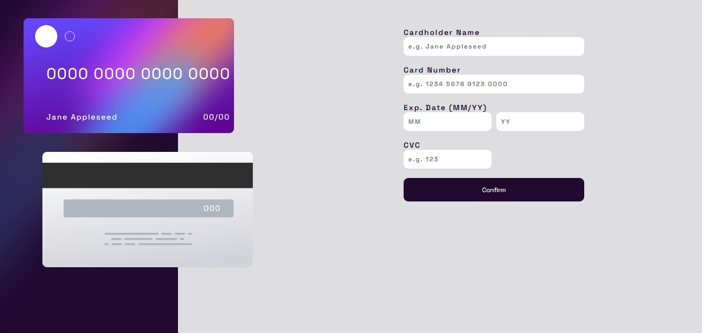
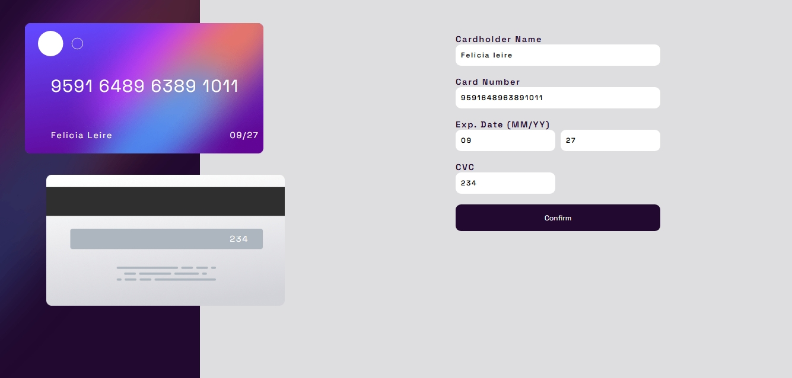
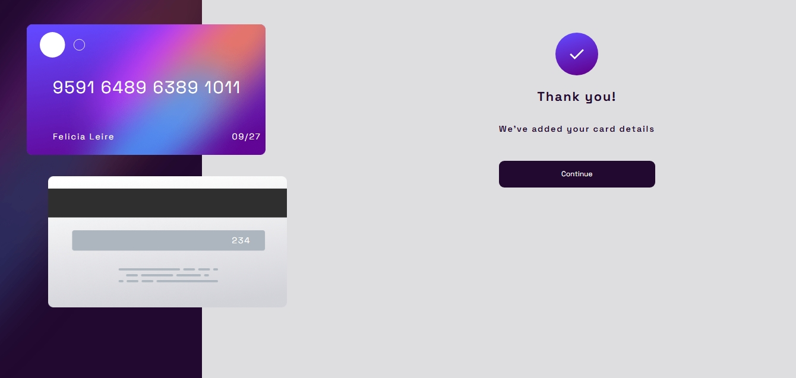

# React + Vite
## 💲 ReactCardEntry
## Table of contents

- [Overview](#overview)
  - [The challenge](#the-challenge)
  - [Screenshot](#screenshot)
  - [Links](#links)
- [My process](#my-process)
  - [Built with](#built-with)
  - [What I learned](#what-i-learned)
  - [Continued development](#continued-development)
  - [Useful resources](#useful-resources)
- [Author](#author)
- [Acknowledgments](#acknowledgments)

## Overview
This project is a React-based credit card input form that simulates the process of filling out card details with real-time visual updates on a card preview. Once the form is submitted and validated, a confirmation screen is displayed.

The app includes:

- A form that captures cardholder name, card number, expiry date (month & year), and CVC.

- A live card preview that updates as the user types.

- Validation logic that checks for proper formatting, completeness, and whether fields are unchanged.

- A confirmation screen once validation succeeds.

## Challenges Faced & Solutions
### ✅Validation of Fields & Default Values
- Challenge: Ensuring users actually updated values and didn’t just submit the form with placeholder defaults.
- Solution: You used a ```defaultValues``` object and compared it against the live form state (info) to check for unchanged values.
```jsx
if (props.info[key] === props.defaultValues[key] || props.info[key].trim() === "") {
   newErrors[key] = `${key} is unchanged or empty.`;
}
```

### ✅Formatting and Validating the Card Number
- Challenge: Preventing invalid characters and enforcing a 16-digit card number.

- Solution: You implemented input formatting in the ```handleChange``` function and used a Yup transform to validate it cleanly.
```jsx
const formatted = raw.replace(/(\d{4})(?=\d)/g, "$1 ");
```
### ✅ Live Card Preview Not Updating on Valid Input
Challenge: Avoiding state updates when the input hasn't actually changed.

Solution: You added checks in ```handleChange``` to detect if values are unchanged, reducing unnecessary renders and warnings.


### ✅ Conditional Rendering of Confirmation Screen
Challenge: Toggling between the form and a "Thank You" screen after a successful submit.

Solution: Introduced a ```formSubmitted``` state to control rendering.

```jsx
{formSubmitted ? <ThankYouScreen /> : <form>...</form>}
```

## Screenshot 






## Links
- [Live Site](https://react-cardentry.netlify.app/)
- [Github Repo](https://github.com/jeff20501/ReactCardEntry)


## My process

### Development Process Summary
#### Set Up Component Structure:
- Created a Page component that contains two child components: ```Card``` (for UI preview) and ```Inputs``` (for form fields).
- Defined a central state object info in ```Page``` using ```useState``` to hold card-related fields (```Cardholder```, ```card_number```, ```month```, ```Year```, ```cvc```).

#### Handled Input Changes:
- Implemented ```handleChange``` to update ```info``` state based on form inputs.
- Applied formatting for ```card_number```:
  1. Removed all non-digit characters using ```.replace(/\D/g, "")```.
  2. Limited to 16 digits using ```.slice(0, 16)```.
  3. Formatted into ```0000 0000 0000 0000``` style using ```.replace(/(\d{4})(?=\d)/g, "$1 ")```.

#### Prevented Redundant State Updates:
- Added a check to compare new values against existing state values.
- If values are unchanged, logged a warning like: ```"card_number is unchanged"``` instead of updating state.
#### Faced Edge Case with State Submission:
- Discovered that unchanged fields were still being "submitted."
- Explored ways to prevent submission of default/unchanged state values (e.g., disabling or conditionally filtering them).
- Considered visual feedback and error messages if values are unchanged or still default.

#### Conditional Rendering Logic:

- Prepared for ```conditional rendering``` using a ```ternary operator```.
- Ensured each step of input and validation logic supported switching between components or views.


## Built with
### ⚙️Technologies Used

- ```Yup```: Form validation and schema definitions
- State Management (```useState```): Handling form values, errors, and render state
- CSS (with media queries): Styling and responsive layout
- ```JSX```: Templating syntax for React components

## 🚀 Suggested Continued Development
1. Add Real-Time Validation Feedback

- Use ```onBlur``` or ```onChange``` to validate fields as the user types.

2. Refactor with ```react-hook-form```

- Simplifies form management and integrates well with Yup.

3. Add Transitions/Animations

- Use libraries like ```Framer Motion``` to animate the confirmation screen.

4. Enhance Mobile Responsiveness

- Use CSS Grid or Flexbox more dynamically for smaller breakpoints.

5. Accessibility Enhancements

- Add ARIA labels, ```htmlFor``` attributes, and better keyboard navigation.

6. Unit Tests

- Write tests for validation logic and rendering using libraries like ```Jest``` or ```React Testing Library```.

7. Backend Integration

- Hook up a dummy API (e.g. using Mock Service Worker) to simulate data submission.


## 🧠 What You Learned
- ### React Form Handling: 
    Controlled components and conditional rendering based on state.

- ### Yup Validation: 
    Creating schemas, customizing error messages, and using transforms.

- ### Input Formatting: 
    Transforming values (like credit card numbers) on-the-fly.

- ### Error Handling & Feedback: 
    Displaying dynamic error messages to guide users.

- ### Responsive Design: 
    Adapting layout for desktop and mobile using media queries.

- ### Code Structuring: 
    Keeping logic separated between components like ```<Inputs />``` and ```<Card />```.


## Useful resources
✅ [Yup Documentation](https://www.npmjs.com/package/yup)
Helped define a clear and powerful validation schema for your form. Especially useful for:

- ```.required()```
- ```.matches()```

- ```.transform()```

- ```.validate({ abortEarly: false })``` for gathering all error messages at once

## Author
- Github - [jeff20501](https://github.com/jeff20501)


## Acknowledgments
[npmjs](https://www.npmjs.com/package/yup)- Provided the Yup library documentation

This template provides a minimal setup to get React working in Vite with HMR and some ESLint rules.

Currently, two official plugins are available:

- [@vitejs/plugin-react](https://github.com/vitejs/vite-plugin-react/blob/main/packages/plugin-react) uses [Babel](https://babeljs.io/) for Fast Refresh
- [@vitejs/plugin-react-swc](https://github.com/vitejs/vite-plugin-react/blob/main/packages/plugin-react-swc) uses [SWC](https://swc.rs/) for Fast Refresh

## Expanding the ESLint configuration

If you are developing a production application, we recommend using TypeScript with type-aware lint rules enabled. Check out the [TS template](https://github.com/vitejs/vite/tree/main/packages/create-vite/template-react-ts) for information on how to integrate TypeScript and [`typescript-eslint`](https://typescript-eslint.io) in your project.
